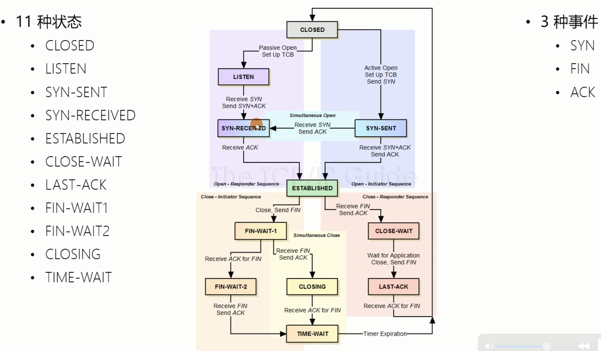
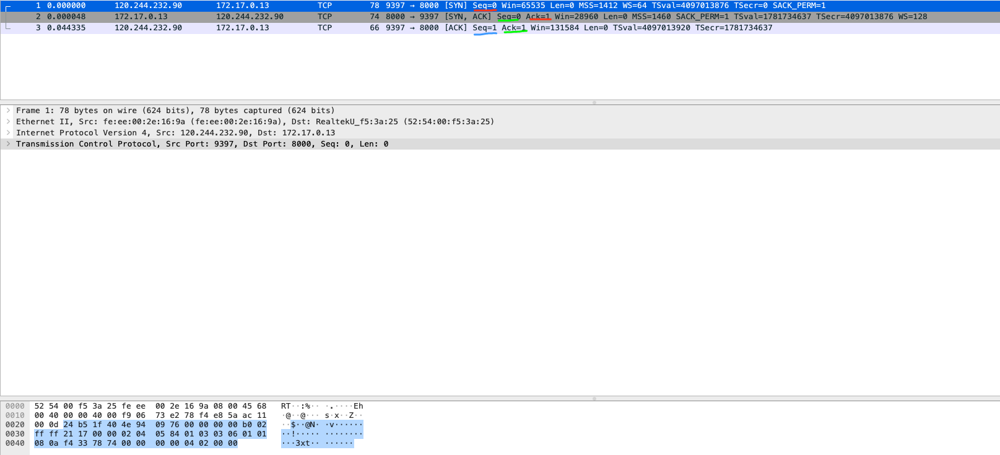
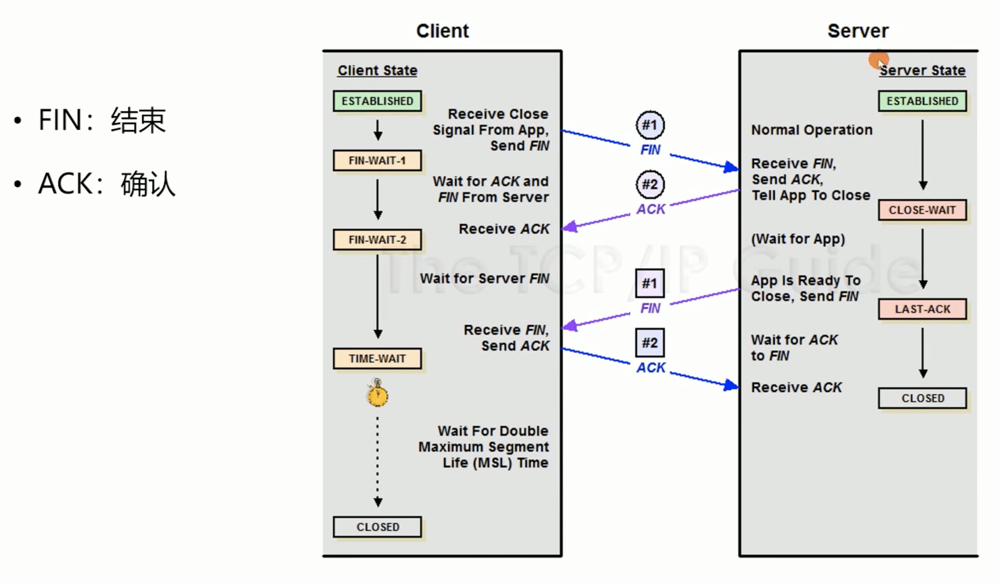
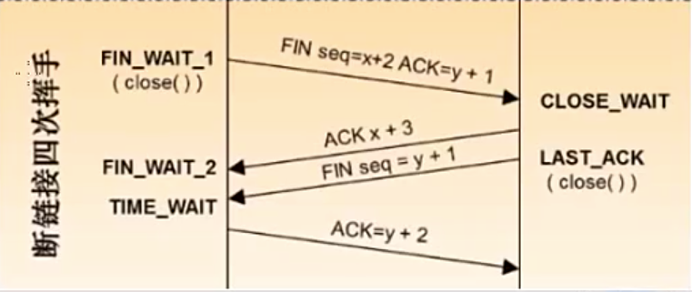
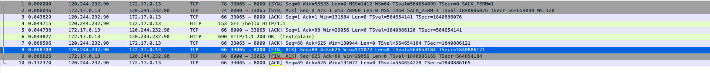

# 网络

## 

## 1. TCP

> 是一种*面向连接的*、*可靠的*、*基于字节流的*传输层通信协议。

- 可靠的：每一次发送报文都要得到对方的确认，来保证消息是可靠的。


### 1. TCP 状态机




#### 1. 常见的信号

1) SYN: 请求建立连接

2. FIN:   断开连接的请求

3. ACK: 请求已确认
4. RST: 


### 2. 三次握手

#### 1. tcpdump 抓包

```bash
# tcpdump -i eth0 port 8000 -nn -c 3 -w tcp_demo.pcap
```


```
参数
-i     监听的网卡
port 监听的端口
-c     抓取三个包后退出
-w    写入到文件中
-n     不解析端口号为协议名
```

#### 2. Wireshark 分析报文




### 3. 四次挥手 或 三次挥手







由于TCP是全双工的，前2次挥手是Client -> Server的半关闭，后2次挥手是Server -> Client的半关闭，合起来才是真正的关闭连接。

这里的半关闭并不是真正意义上的关闭

主动关闭的一方会进入 TIME-WAIT 状态


#### 1. TIME-WAIT -> CLOSED

**MSL (Maximum Segment Lifetime)**

一个TCP报文在网络上存活的最大时间


**维持2MSL时长的 TIME-WAIT 状态**

- 保证至少一次报文的往返时间内端口是不可用的


要等2MSL(Maximum Segment Life)时间，MSL是一个TCP报文在网络上存活的最长时间。

主动关闭的一方会主动进入TIME-WAIT状态，通常会保持2分钟左右，端口是被占用的。


#### 2. TIME-WAIT 优化

1) net.ipv4.tcp_tw_reuse = 1

开启后，作为客户端时新连接可以使用仍然处于 TIME-WAIT 状态的端口。

由于 timestamp 的存在，操作系统可以拒绝迟到的报文。 net.ipv4.tcp_timestamps = 1 这个也同时开启


2. net.ipv4.tcp_tw_recycle = 0

开启后，同时作为客户端 和 服务器 都可以使用 TIME-WAIT 状态的端口

不安全，无法避免报文延迟，重复等给新连接造成混乱


3. net.ipv4.tcp_max_tw_buckets = 262144

time_wait 状态连接的最大数量

超出后直接关闭连接


#### 3. Wireshark 分析三次挥手




从截图来看，确实是三次挥手，而不是四次挥手。


### 


### 4. 滑动窗口

TCP 是按Seq序列号接收数据的


### 5. 拥塞控制


### x. 常见问题

#### 1. SYN中Seq为什么不同

>  三次握手中，为什么要Seq到序列号都要+1，而不是用相同的一个序列号？

因为报文在网络上传输会有延迟，会有丢失，会有重传机制，为了区分这些问题所以序列号要一直累加不能重复。


#### 2. mtu 是什么


#### 3. 为什么握手要三次而不是二次

因为IO通信是双向的

站在客户端一方来看，客户端发送SYN，并得到服务端回复了ACK，此时表示客户端的输入和输出都是通的。

站在服务端一方来看，服务端回复了客户端的ACK，但是自已发送的SYN并没有得到回复，此时仅能表示服务端输入是通的，输出无法保证。

因此握手必须三次，才能保证彼此的输入和输出是通的。


## 2. HTTP


