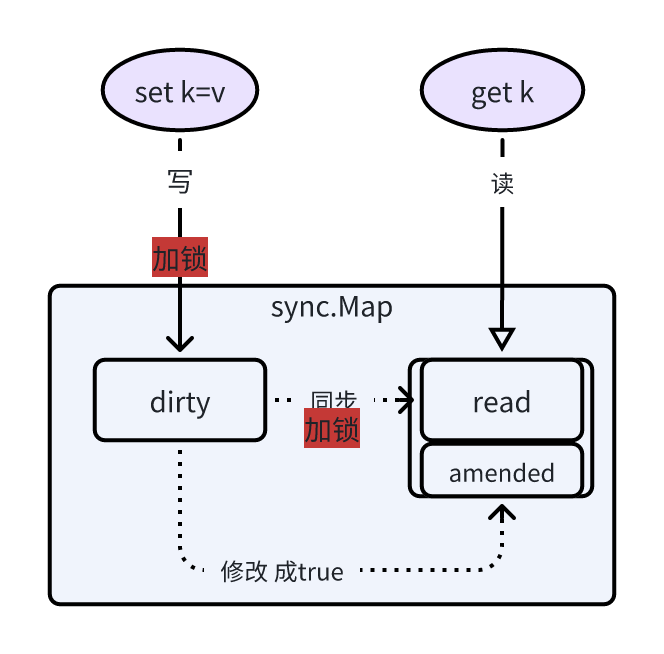

# sync.Map

_sync.Map 在 读多写少的场景下 性能优于 原生的 map，主要是因为在读场景下如果命中通过atomic操作可以不加锁。_
_但是在 写多读少 的情况下，性能就远低于 原生的map，主要是因为要写2次map（read和dirty表）_

- sync.Map 是通过空间换时间的方式来优化的，底层通过2张Map来实现。


## sync.Map 底层数据结构
```go
type Map struct {
	mu Mutex                      // 互斥锁，主要保护 dirty 表的写操作 和 dirty向read表同步数据时
	read atomic.Pointer[readOnly] // 读 map
	dirty map[any]*entry          // 写map
	misses int
}

type readOnly struct {
	m       map[any]*entry
	amended bool  // 标记dirty表中是否拥有不存在于read表中的数据
}

type entry struct {
    p atomic.Pointer[any]
}
```

## 读写流程



**新增数据**  
插入数据首先会暂时放置到 dirty 表中 并且设置 read 表中的 amended 字段设置成true， 为true表示 dirty表中的暂存数据还未向read表同步数据
 
**查找数据**  
- 检索数据通过 Load() 方法，会先查询 read 表，如果查询到则直接返回，如果数据不存在则会根据amended的值来决定是否向 dirty 表中继续查询，如果为true
则会继续查询，如果为false，则不用查询。  
- 当检索数据需要 dirty 表时，则会为 read表记录一次miss(+1)，当miss的次数达到dirty表中存放的数据条数时，dirty表的数据将全部转移给 read表。