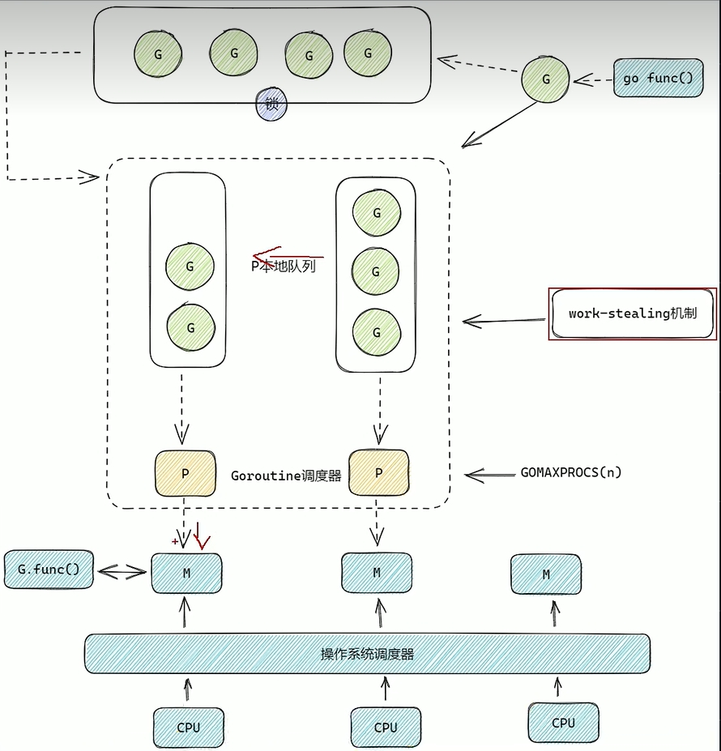

# 概念

## 1. GMP调度模型

[//]: # (![GMP模型]&#40;./images/gmp_mode.png&#41;)




### 三个实体的缩写

- Goroutine  
go 关键字执行的函数，要执行的业务代码，统称为 goroutine

- Machine  
内核的物理线程，Go语言在此基础上进行了封装  
正常M的数量要大于P的数量
M才是真正执行G的载体

- Processor  
逻辑处理器 或者 goroutine的调度器，负责调度G的执行； 
每个P上都有一个runqueue队列
正常P的数量等于CPU的数量

### local runq 和 global runq

- local runq  本地队列，每个P上都有一个runq，最多可以存放256个G，主要是在这里获取G不需要加锁
- global runq 全局队列，从这里获取G时需要加锁和解锁


### 执行G的过程

P是负责调度G的，创建G时会先把G放入P的一个本地队列中，M要和P建立绑定关系，P调度本地队列中的G到M进行执行。

如果P上的队列中的G被执行完了，那么P会从全局队列中拿G，但是如果从全局队列中拿G就要加锁，势必会影响一定的性能。

从全局队列中拿G是为了防止部分G饿死。

### work stealing 工作窃取

如果 P1 队列中的 G 都被执行完了，那么 P1 可以通过工作窃取的方式，从其它比如 P2 队列中上拿取一半的 G 放入到自已的本地队列中，
P1 在继续调度本地队列中的G继续执行。

// runtime/proc.go
```go
// Finds a runnable goroutine to execute.
// Tries to steal from other P's, get g from local or global queue, poll network.
// tryWakeP indicates that the returned goroutine is not normal (GC worker, trace
// reader) so the caller should try to wake a P.

//查找一个可运行的goroutine来执行。
//试图从其他P中窃取，从本地或全局队列中获取g，轮询网络。
//tryWakeP表示返回的goroutine不正常（GC worker，trace
//读者），因此来电者应尝试唤醒P。
func findRunnable() (gp *g, inheritTime, tryWakeP bool) {
	
	...

	// Check the global runnable queue once in a while to ensure fairness.
	// Otherwise two goroutines can completely occupy the local runqueue
	// by constantly respawning each other.
	// 定期检查全局可运行队列以确保公平性。
	// 否则两个 Goroutine 可能会通过不断地相互生成新任务来完全占用本地运行队列。

	// schedtick 是一个计数器，它记录了处理器 P 调度任务的次数。
	// 这行代码表示每执行 61 次本地任务后，处理器会检查一次全局队列，以防止局部的 Goroutine 执行被“饿死”。
	if pp.schedtick%61 == 0 && sched.runqsize > 0 {
        lock(&sched.lock)
		// 尝试从全局队列中获取一个 Goroutine。
		// 同时它也可能会将多个 Goroutine（最多 2 个）加入到本地队列中。这种用法一般用于周期性检查或其他情况，确保本地队列得到填充。
        gp := globrunqget(pp, 1) 
        unlock(&sched.lock)
        if gp != nil {
            return gp, false, false
        }
    }
	
	...

	// local runq
	// 从P队上获取一个G来执行
	if gp, inheritTime := runqget(pp); gp != nil {
        return gp, inheritTime, false
    }

    // global runq
    if sched.runqsize != 0 {
        lock(&sched.lock)
		// // 尝试从全局队列中获取一个 Goroutine。
        gp := globrunqget(pp, 0)
        unlock(&sched.lock)
        if gp != nil {
            return gp, false, false
        }
        }
        
    }
```

### 系统调用 引起阻塞

如果M在绑定P后，执行P上的G时，发生了系统调用，这时要阻塞，为了使P上的其它的G继续执行，这个时候P就要和M解绑，
让此时M1和G1单独绑定；让P去寻找其它的M，如果有其他休眠的M，唤醒使其和P绑定，继续执行其它的G；一段时间后，原来
阻塞的M1和G1系统调用完成，这个时候如果有空闲的P则进行绑定继续执行G1，反之则把G1放入到全局队列中。


## 3. GC垃圾回收

> 三色标记法和混合写屏障

三色标记法 是用三种颜色来区分  
- 白色 表示 对象的初始状态 
- 灰色 表示 对象的中间过度状态
- 黑色 表示 活跃的对象


标记和清除  
_标记阶段_
1. 默认情况，所有的对象均放入到白色集合中，标记为白色  
2. 从根对象(堆，栈上的对象）开始，如果对象有被引用，就从白色集合放入到灰色集合中，颜色标记为灰色
3. 遍历全部的灰色集合中的对象，如有有被引用，那么就把白色集合中的对象放入到灰色集合中，并把被引用的灰色对象放入到灰色集合中
4. 循环执行上述3动作，直到灰色集合中没有对象为止  

_清理极端_  
5. 最终黑色对象就是活跃对象，是要保留的对象，而白色集合中的对象就要全部清理。

但是我们知道，在进行gc时是动态的，白色对象很有可能在进行gc时会被黑色对象引用，
这个时候如果被引用了，那么白色对象就会被下一轮的gc回收，导致意想不到的问题，因此引入了混合写屏障
就是为了解决在如果黑色对象引用了白色对象，那么就把白色对象放入到灰色的集合中，通过第4轮标记阶段进行处理。

所谓混合写屏障就是在进行对象引用时，会触发写屏障，让程序运行和垃圾回收同时运行，减少STW的时间。


## 3. GC垃圾回收何时触发

_三种情况会触发gc回收_
- 手动触发，调用 runtime.GC()
- 当前堆内存大小是上一次gc触发堆大小的2倍时 会自动触发
- 定时任务，2分钟触发一次


